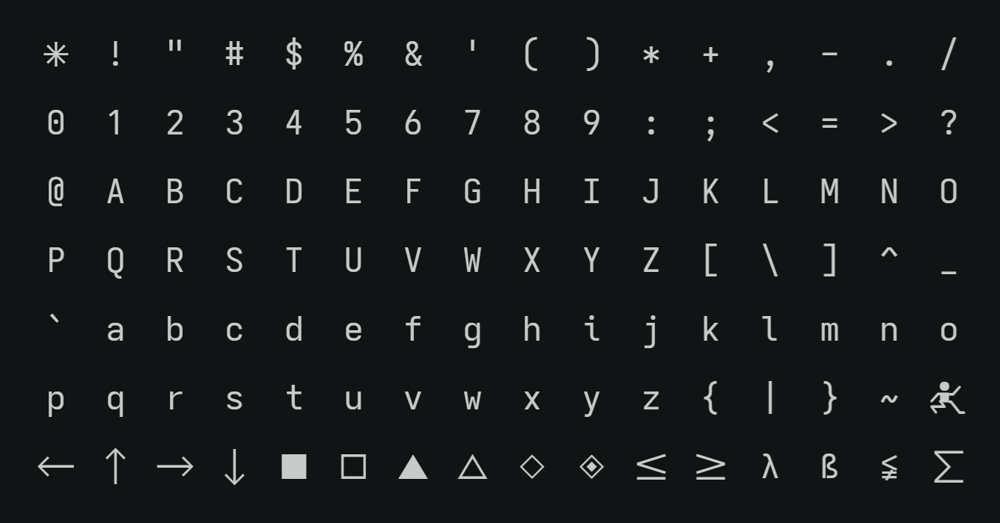
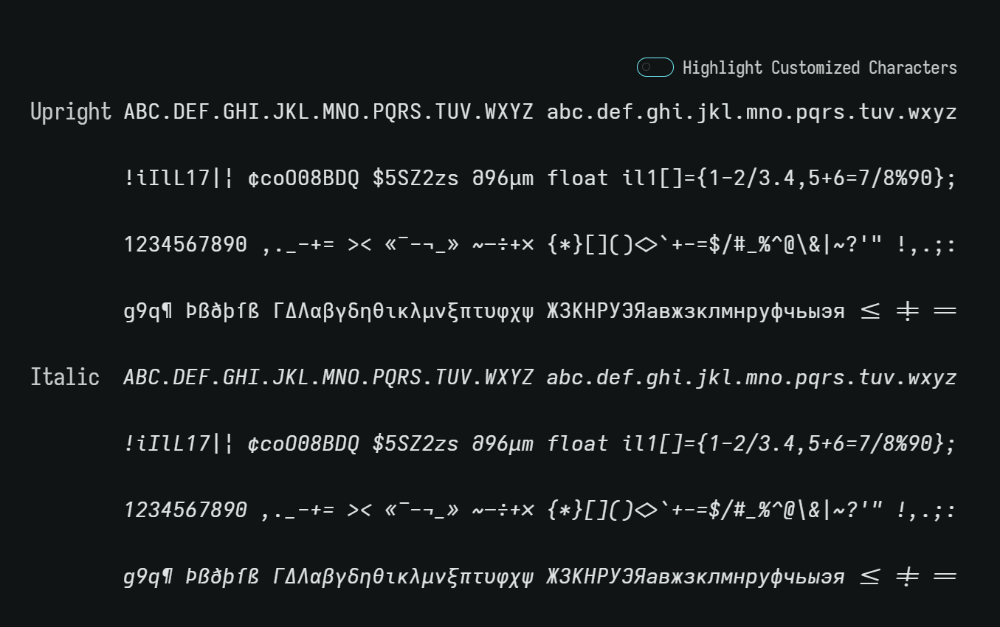
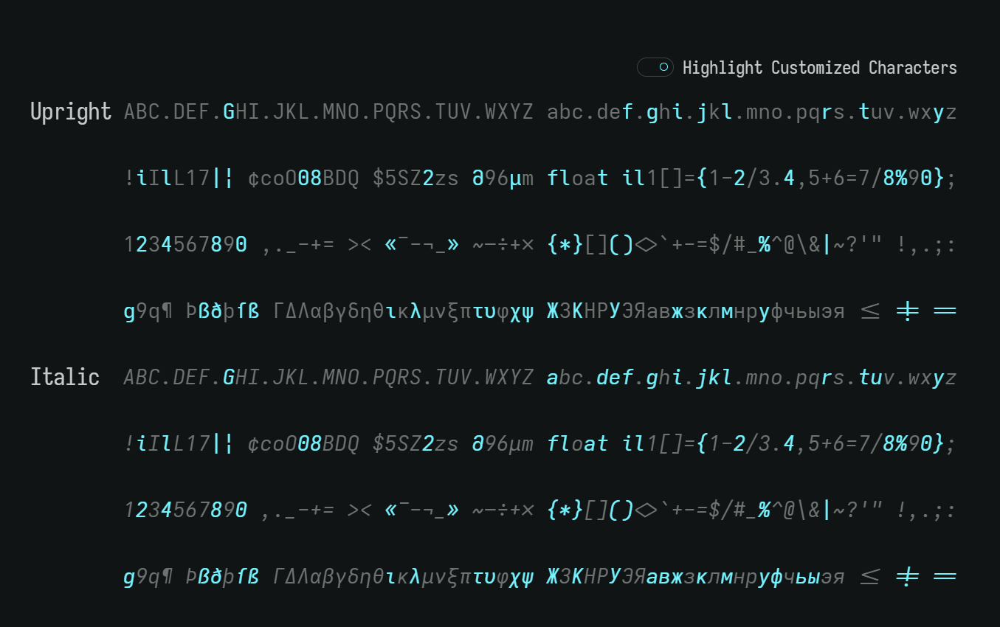

# Iosevka Lofi

**Iosevka Lofi** is a personalized build of the
[Iosevka](https://typeof.net/Iosevka) font. It combines the **Menlo Style (ss04)
glyphs** with selected adjustments inspired by **Hack**, resulting in a clean,
minimal, and highly readable monospace font.

## ✨ Concept

Iosevka Lofi was originally created for my personal use. I enjoyed Hack for its
shapes, but it had a few drawbacks for me. With Iosevka’s build system, I was
able to fine-tune the design to get exactly what I wanted:

- Mostly Menlo-inspired (ss04) base
- Adjusted characters closer to Hack style
- Optimized for programming, terminals, and text editing

## 📂 Project structure

This folder contains:

- `/builds/` -> pre-built font files ready to install
- `iosevka-lofi.toml` -> build plan for the font

## 🔤 Preview

## 🛠 Installation

You can install the font by:

1. Navigating to the `/builds/` folder
2. Downloading and installing the font files for your operating system
   - **Windows**: right-click → _Install_
   - **macOS**: double-click → _Install Font_
   - **Linux**: copy to `~/.fonts` or `~/.local/share/fonts`

## 📜 License

This project is a derivative build of **Iosevka**, which is licensed under the
[SIL Open Font License 1.1](https://openfontlicense.org/). Therefore, **Iosevka
Lofi is also distributed under the SIL Open Font License 1.1**.

Please see the included `LICENSE.txt` file for full license details.
